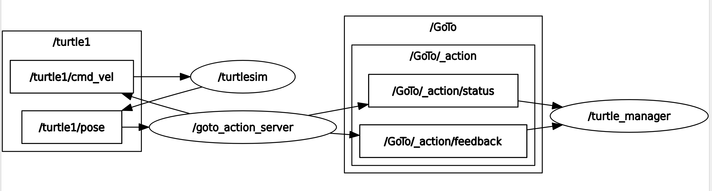
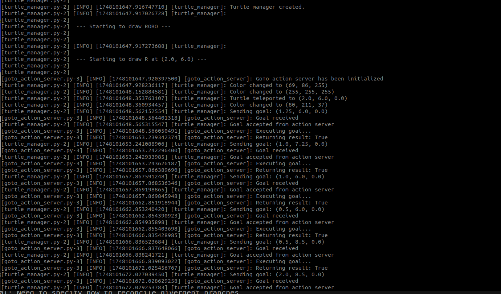
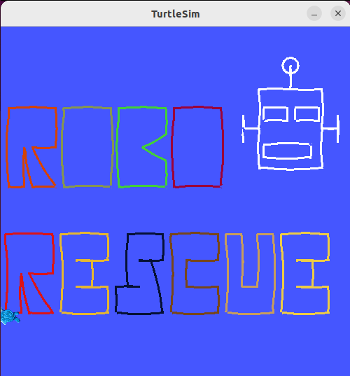
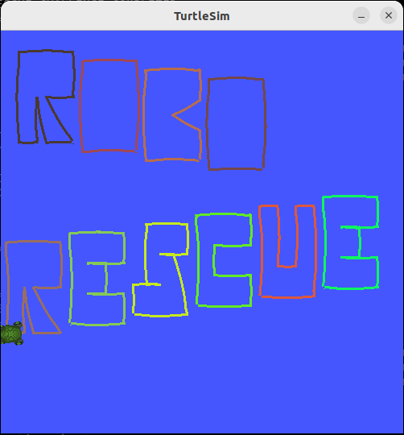
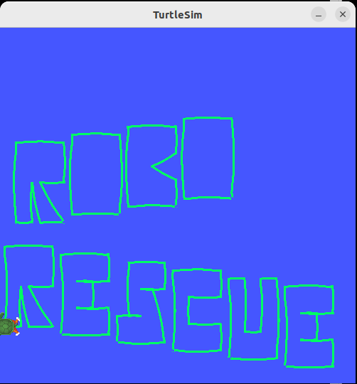
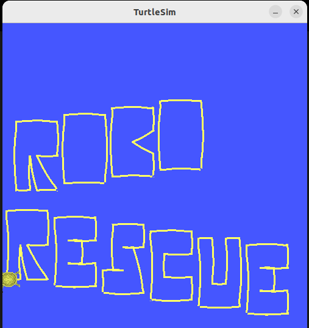
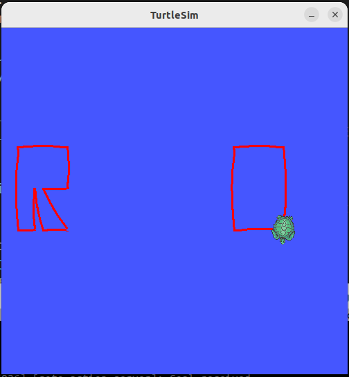
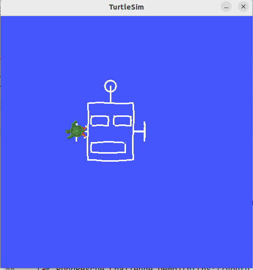
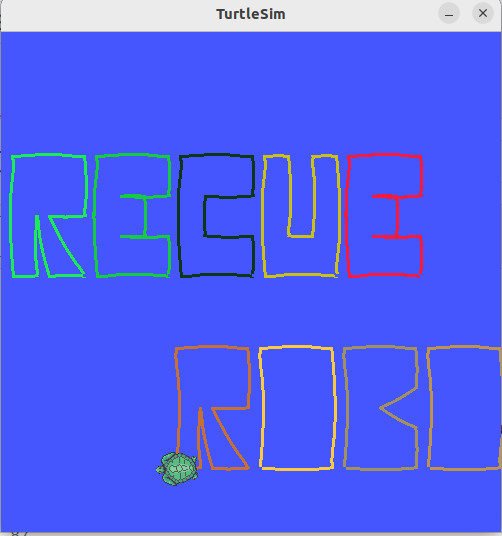

# 🐢 RoboRescue UMA – MINI-PROJECT-1-2025

## ✨ Project Name: **ROBORESCUE Turtle Artist**

This repository contains our solution for the MINI-PROJECT-1-2025 challenge organized by RoboRescue UMA.

The goal of this project is to control the turtle in the turtlesim simulator using ROS 2 to draw custom words in a stylized way.

Our approach is designed to be highly configurable and user-friendly: by simply changing a few parameters, users can easily make the turtle draw any word using predefined letter, customizable colors, sizes, directions, positions and styles.

This allows for creative and flexible word rendering without needing to modify the core logic.

---

## 📁 Repository Contents

- `ros2_ws/`: ROS 2 package containing all source code.
- `media/`: Video demonstrating the result.

- The configurable file (config.yaml) could be easily founded in the following path: `ros2_ws/roborescue/config/config.yaml`
---

## 🧠 Project Highlights

- ✅ **Customizable word drawing (left-to-right & right-to-left)**  
  Easily render words in both directions using a flexible configuration system.

- ✅ **Clean transitions between letters using teleportation**  
  Lines between letters are hidden using color screen, creating clear and aesthetic word shapes.

- ✅ **Modular and scalable architecture**  
  Drawing logic, control routines, and utility functions are separated into clean, maintainable components.

- ✅ **Enhanced turtle control via ROS 2 services and custom actions**  
  Uses `turtlesim` services and a custom `GoTo` action to achieve precise and responsive movements.

- ✅ **Easy configuration with YAML**  
  All parameters (words, initial positions, pen width, etc.) are defined in a single YAML file, making customization quick and user-friendly.

- ✅ **One-command startup with `ros2 launch`**  
  Includes a launch file to start the system effortlessly.

- ✅ **Robust configuration validation**  
  Includes checks to prevent invalid parameters and ensure stable operation.

- ✅ **Real-time feedback in the terminal**  
  The terminal displays each step of the process to improve clarity and user experience.

- ✅ **Custom drawings**  
  In the configuration file, the user has the option to draw a robot by enabling the `draw_robot` setting.
---
   <p align="center">
     
     
   </p>

## 🚀 How to Run the Project

### 1. Clone the repository in the home and build the workspace:
```bash
cd
git clone https://github.com/mariogsc12/RoboRescue_Challenge.git
cd ~/RoboRescue_Challenge/ros2_ws/
colcon build
source install/setup.bash
```
### 2. (Optional) Change the configuration:
```bash
cd ~/RoboRescue_Challenge/ros2_ws/
nano roborescue/config/config.yaml
```
💡 Tip: You can use your favorite editor instead of nano (vim, vscode, gedit...).

### 3. Run the project using the launch script:
```bash
ros2 launch roborescue launch.launch.py
```

## 🛠️ Dependencies

  - ROS 2 Humble 

  - turtlesim package (http://wiki.ros.org/turtlesim)


## 🎥 Demo Video

[🚀 RoboRescue Challenge Demo](https://youtu.be/XpB3d0KuchI)



## 🎨 Visual Variations
You can easily change the appearance of the output by modifying parameters in the YAML config file.

Here are some example variations:
1. **Add Y offset to draw in diagonal**  
   

2. **Use fixed color**  
   <p align="left">
     
     
   </p>

3. **Increase X offset**  
   

4. **Draw only a robot**
   
   

5. **Change the words**
   
   

## ⚙️ Future Development

- Add support for more letters and complex drawings.  
- Implement parallel processing of letters using multiple turtles simultaneously to speed up drawing.    
- Add customizable colors and styles per letter or word.  
- Integrate advanced path planning to avoid overlaps and collisions between turtles and walls.  
- Additionally, there one branch available `different_turtles`, which is used to make the changes necessary to draw a word using different turtles moving in parallel.
---
   
## 🙌 Acknowledgments

Thanks to the RoboRescue UMA team for organizing this fun and educational challenge!
